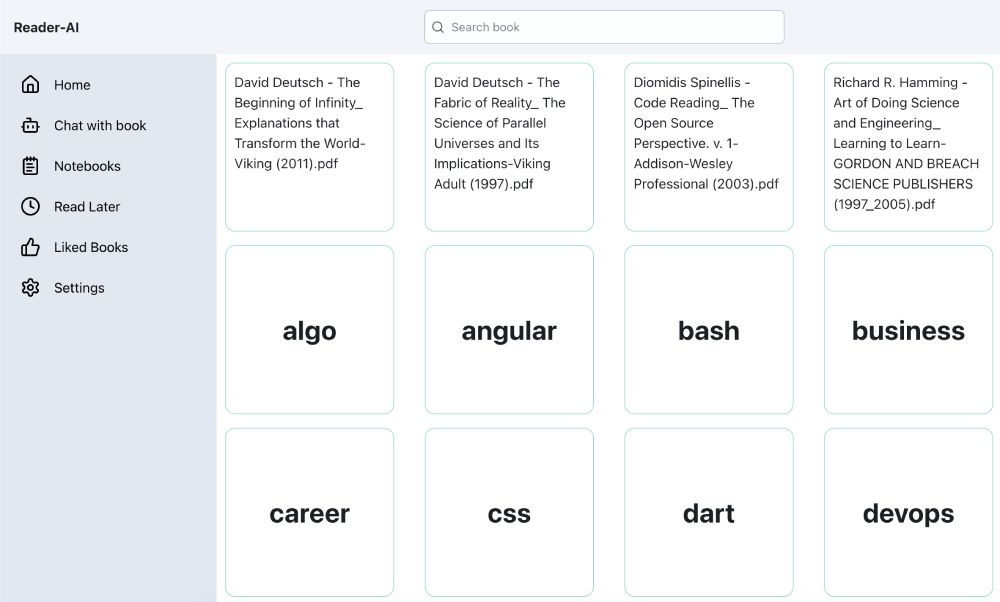

# My ebook reader, enhanced by AI

## Backend

implement server side using different ways:

- nodejs: fastify
- python: fastapi
- rest api
- graphql

## Frontend

implement client side using different ways:

- typescript
- nextjs
- svelte

## Roadmap

- [x] server apis
- [x] swagger api docs
- [x] list local books
- [ ] hybrid search book, local/online
- [ ] view pdf, epub, markdown file
- [ ] chat with book, local LLM, other AI endpoints
- [ ] notebook, for note taking
- [ ] read later
- [ ] liked books
- [ ] LLM setting
- [ ] RAG playground
- [ ] share book
- [ ] upload book
- [ ] create own book, like gitbook

## Credits

- [react-pdf](https://github.com/wojtekmaj/react-pdf)

## License

MIT
